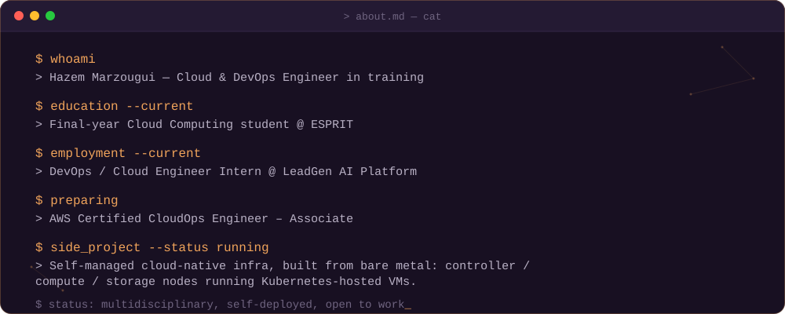
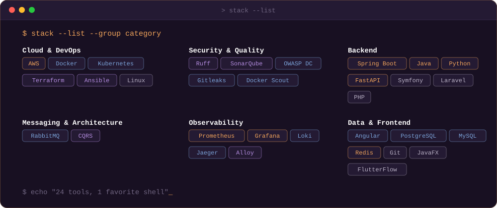
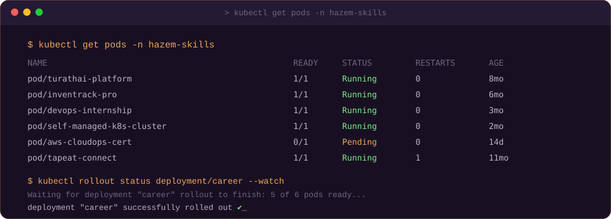
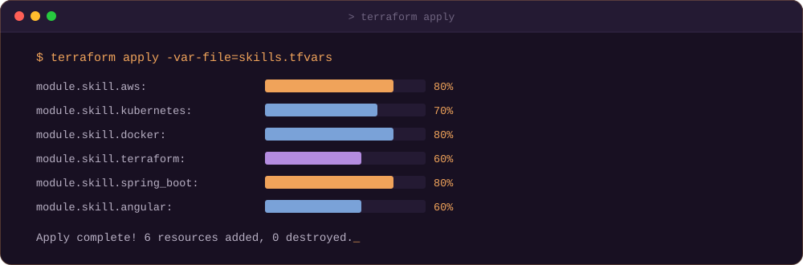
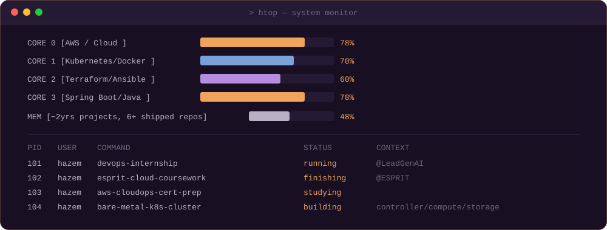
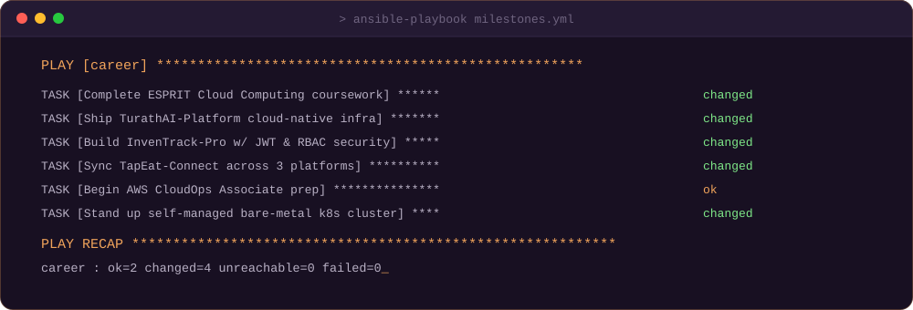
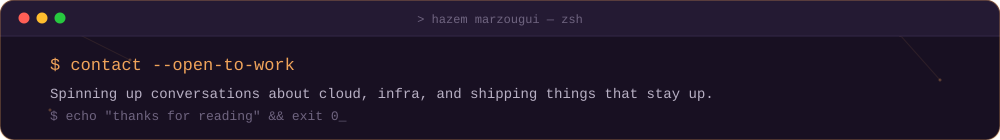

 

 

## `$ cat about.md`

 

## `$ stack --list`

 

## `$ kubectl get pods -n hazem-skills`

 

## `$ terraform apply`

 

## `$ htop` — personal system monitor

 

## `$ ansible-playbook milestones.yml`

 

## `$ git log --graph --stat` — featured projects

<table width="100%">
<tr>
<td width="50%"></td>
<td width="50%"></td>
</tr>
<tr>
<td width="50%"></td>
<td width="50%"></td>
</tr>
<tr>
<td width="50%"></td>
<td width="50%"></td>
</tr>
</table>

 

## `$ kubectl top` — contribution telemetry

  

  

 

 

## `$ curl -X POST /contact`

